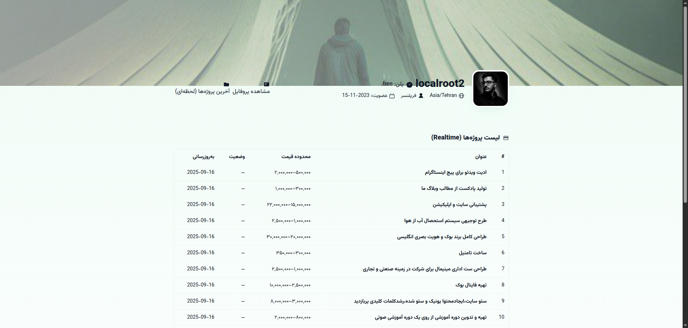

# 📦 ponisha-cli


> ابزار خط فرمان برای جستجو و دریافت پروژه‌های پونیشا

---

## 📝 معرفی

`ponisha-cli` یک ابزار سادهٔ **Python CLI** است که به کمک API پونیشا، پروژه‌ها را واکشی و نمایش می‌دهد.
هدف اصلی این ابزار: **سادگی، سرعت، و خروجی استاندارد JSON** برای استفاده در اسکریپت‌ها یا تحلیل داده‌ها.

---

## 🚀 نسخه‌ها (Changelog)

### 🔖 v1.0.0

* اولین انتشار
* پشتیبانی از:

  * جستجوی پروژه‌ها
  * نمایش نتایج به‌صورت JSON
* دستور اجرا:

  ```bash
  python3 main.py
  ```

---

## 📂 ساختار پروژه

```
ponisha-cli/
├─ main.py         # فایل اصلی اجرای CLI
├─ Urls.py         # آدرس‌های API پونیشا
├─ header.py       # هدرهای HTTP (Authorization و …)
├─ requirements.txt
└─ readme.md
```

---

## ⚙️ پیش‌نیازها

* Python **3.10+**
* ماژول‌های داخل `requirements.txt` (با `pip install -r requirements.txt` نصب می‌شوند)

---

## 🛠️ نصب

<svg xmlns="http://www.w3.org/2000/svg" width="20" height="20" fill="#4FB885" viewBox="0 0 24 24"><path d="M12 0l8 6v12l-8 6-8-6V6z"/></svg> کلون پروژه:

```bash
git clone https://github.com/localho3t/ponisha-cli.git
cd ponisha-cli
```

<svg xmlns="http://www.w3.org/2000/svg" width="20" height="20" fill="#4FB885" viewBox="0 0 24 24"><path d="M12 2a10 10 0 1010 10A10.011 10.011 0 0012 2zm1 15h-2v-2h2zm0-4h-2V7h2z"/></svg> نصب وابستگی‌ها:

```bash
pip install -r requirements.txt
```

---

## ▶️ اجرا

<svg xmlns="http://www.w3.org/2000/svg" width="20" height="20" fill="#4FB885" viewBox="0 0 24 24"><path d="M8 5v14l11-7z"/></svg> دستور اجرا:

```bash
python3 main.py
```

---

## 📸 تصاویر



---

## 🔐 نکات امنیتی

* توکن شخصی **Bearer Token** را در `header.py` تنظیم کنید.
* توکن را **در مخزن عمومی کامیت نکنید**. برای امنیت بیشتر از متغیر محیطی استفاده کنید.

---

## 🧩 آینده (TODO)

* پشتیبانی از فیلتر بر اساس مهارت‌ها
* خروجی CSV/JSONL
* نمایش پروفایل کاربر

---

## 📜 مجوز

این پروژه فعلاً بدون مجوز مشخص منتشر شده است. در صورت استفاده در پروژه‌های شخصی آزادید، برای استفاده تجاری لطفاً با نویسنده هماهنگ کنید.
